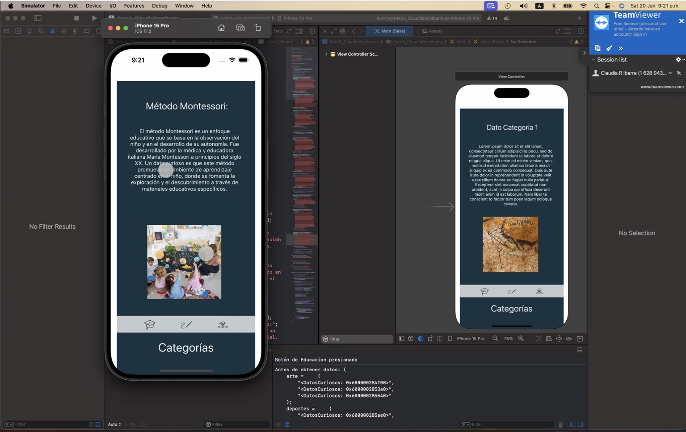
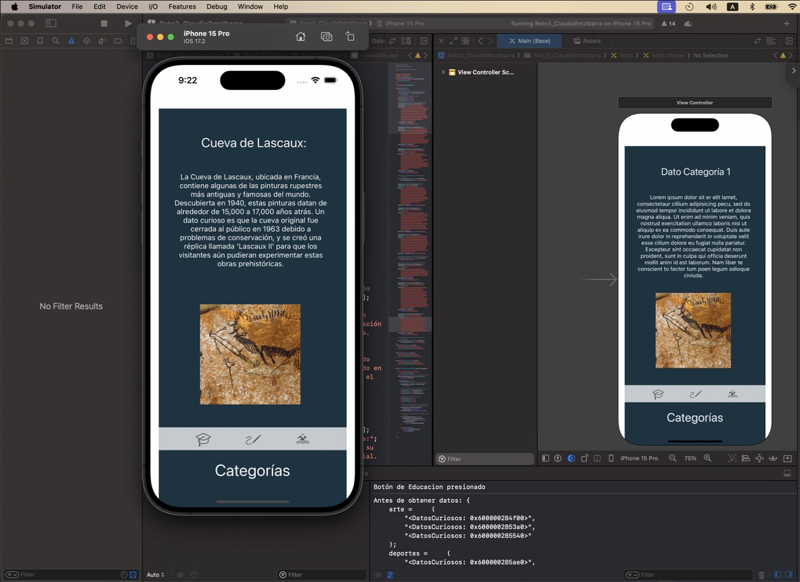
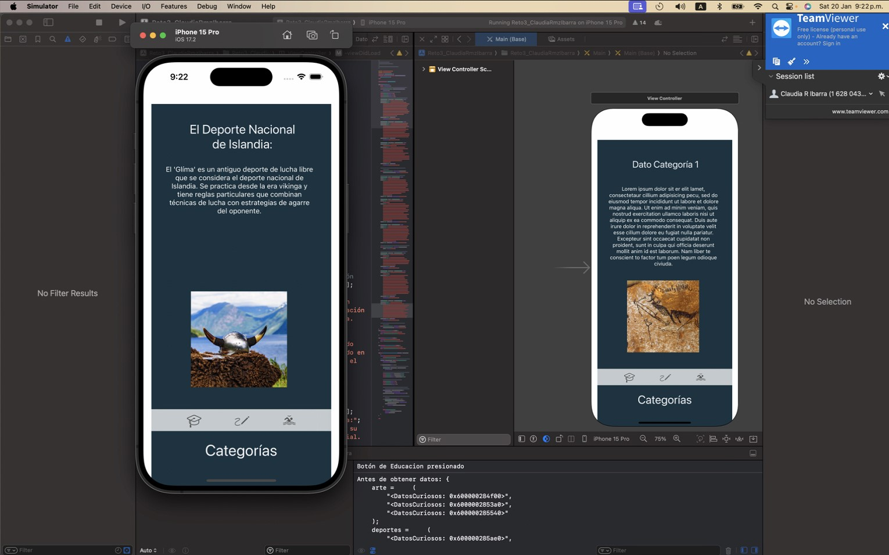

# Proyecto "¿Sabías qué?"

## Introducción
Este proyecto, denominado "¿Sabías qué?", fue desarrollado como parte de la materia de Desarrollo de Aplicaciones Móviles en iOS. La aplicación tiene como objetivo proporcionar información curiosa sobre diversos temas, enfocándose en categorías como educación, arte y deportes. La interfaz ha sido diseñada considerando la diversidad de usuarios, desde niños hasta adultos mayores, con una presentación intuitiva y accesible.

## Perfil de usuario a quien va dirigido
**Edad:** Desde niños de 7 años hasta adultos mayores 60+

**Nivel de Educación:** Todos los niveles educativos. El único requisito sería que sepan leer, pues aún no ha sido implementada la función para que los datos curiosos sean leidos por la aplicación.

**Experiencia Tecnológica:** Desde principiantes hasta usuarios avanzados. Se ha optado por una interfaz intuitiva con un menú inferior para facilitar la navegación que ayuda a la experiencia de usuario y sigue con las guias de diseños de los componentes ios.

**Frecuencia de Uso:** Diseñada para uso esporádico, debido a que los datos curiosos no son actualizados de forma diaria.

## Wireframe


## Datos Curiosos
Para lograr la presentación de datos curiosos, se ha creado una clase específica llamada `DatosCuriosos.h` [ir a archivo](Reto3_ClaudiaRmzIbarra/DatosCuriosos.h). Esta clase se encarga de encapsular la información de cada dato, incluyendo título, texto explicativo e imagen ilustrativa. A continuación, se muestra el código de la clase `DatosCuriosos`:

```objective-c
//
//  DatosCuriosos.h
//  Reto3_ClaudiaRmzIbarra
//
//  Created by Tsukimo on 20/01/24.
//

#import <Foundation/Foundation.h>
#import <UIKit/UIKit.h>
@interface DatosCuriosos : NSObject

@property (nonatomic, strong) NSString *titulo;
@property (nonatomic, strong) NSString *texto;
@property (nonatomic, strong) UIImage *imagen;

@end


```

## ViewController
El código del `ViewController` [ir a archivo](Reto3_ClaudiaRmzIbarra/ViewController.m) está diseñado para manejar las diferentes categorías de datos curiosos, estos datos curiosos están en un diccionario y asignados a una categoría específica. Este diccionario hace uso de la clase creada en el paso anterior.

```objective-c
[super viewDidLoad];
// Inicializa el diccionario con datos curiosos
self.datosPorCategoria = [NSMutableDictionary dictionary];
// Oculta los elementos por defecto
self.Dato_Cat.hidden = YES;
self.Dato_text.hidden = YES;
self.Dato_image.hidden = YES;
// Datos curiosos para la categoría de educación
DatosCuriosos *educacion1 = [DatosCuriosos new];
educacion1.titulo = @"Método Montessori:";
educacion1.texto = @"El método Montessori es un enfoque educativo que se basa en la observación del niño y en el desarrollo de su autonomía. Fue desarrollado por la médica y educadora italiana Maria Montessori a principios del siglo XX. Un dato curioso es que este método promueve un ambiente de aprendizaje centrado en el niño, donde se fomenta la exploración y el descubrimiento a través de materiales educativos específicos.";
educacion1.imagen = [UIImage imageNamed:@"educacion1.jpg"];
// Resto de los datos curiosos de educación...

// Agrega los datos curiosos de educación al diccionario
[self.datosPorCategoria setObject:@[educacion1, educacion2, educacion3] forKey:@"educacion"];

```

En ese mismo archivo se encuetran las funcionalidades de los botones, se agregó además un log para poder verificar si los botones son presionados.

```objective-c
- (IBAction)Sport_button:(id)sender {
    NSLog(@"Botón de Deportes presionado");
    [self mostrarDatosParaCategoria:@"deportes"];
}

- (IBAction)Art_button:(id)sender {
    NSLog(@"Botón de Arte presionado");
    [self mostrarDatosParaCategoria:@"arte"];
}

- (IBAction)Education_button:(id)sender {
    NSLog(@"Botón de Educacion presionado");
    [self mostrarDatosParaCategoria:@"educacion"];
}
```

Por último en este mismo archivo se encuentra una función que tiene la tarea de hacer un reacomodo de los datos curiosos de modo que si uno de ellos ha sido mostrado sea lanzado al final de la lista.

```objective-c
- (void)mostrarDatosParaCategoria:(NSString *)categoria {
    NSLog(@"Antes de obtener datos: %@", self.datosPorCategoria);
    // Obtén los datos curiosos para la categoría actual
    NSArray *datosCuriosos = [self.datosPorCategoria objectForKey:categoria];
    
    if (datosCuriosos.count > 0) {
        // Obtiene el primer dato curioso de la lista
        DatosCuriosos *datoCurioso = [datosCuriosos firstObject];
        
        // Actualiza la interfaz con los datos curiosos
        self.Dato_Cat.text = datoCurioso.titulo;
        self.Dato_text.text = datoCurioso.texto;
        self.Dato_image.image = datoCurioso.imagen;
        
        // Muestra los elementos con datos
        self.Dato_Cat.hidden = NO;
        self.Dato_text.hidden = NO;
        self.Dato_image.hidden = NO;
        
        // Mueve el primer dato al final de la lista para mostrar el siguiente en la próxima vez
        NSMutableArray *mutableDatosCuriosos = [datosCuriosos mutableCopy];
        [mutableDatosCuriosos removeObjectAtIndex:0];
        
        // Agrega el siguiente dato curioso al final de la lista
        if (mutableDatosCuriosos.count > 0) {
            DatosCuriosos *siguienteDatoCurioso = [mutableDatosCuriosos firstObject];
            [mutableDatosCuriosos addObject:siguienteDatoCurioso];
        }
        
        [self.datosPorCategoria setObject:mutableDatosCuriosos forKey:categoria];
    }
}
```
## Capturas de aplicación en funcionamiento

A continuación se tiene algunas imágenes del funcionamiento de la aplicación:
### Ejemplo dato curioso en categoría educación

### Ejemplo dato curioso en categoría Arte

### Ejemplo dato curioso en categoría Deporte
