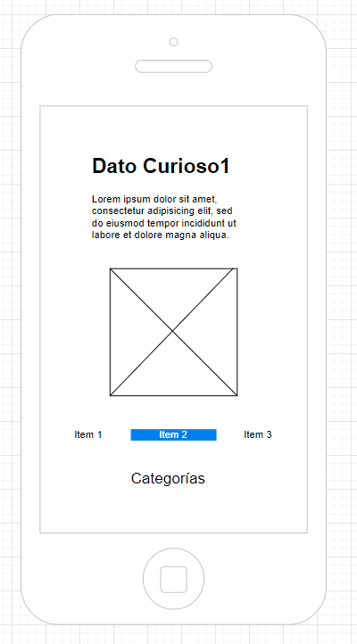

# Proyecto "¿Sabías qué?"

## Introducción
Este proyecto, denominado "¿Sabías qué?", fue desarrollado como parte de la materia de Desarrollo de Aplicaciones Móviles en iOS. La aplicación tiene como objetivo proporcionar información curiosa sobre diversos temas, enfocándose en categorías como educación, arte y deportes. La interfaz ha sido diseñada considerando la diversidad de usuarios, desde niños hasta adultos mayores, con una presentación intuitiva y accesible.

## Wireframe


## Datos Curiosos
Para lograr la presentación de datos curiosos, se ha creado una clase específica llamada `DatosCuriosos.h`. Esta clase se encarga de encapsular la información de cada dato, incluyendo título, texto explicativo e imagen ilustrativa. A continuación, se muestra el código de la clase `DatosCuriosos`:

```objective-c
//
//  DatosCuriosos.h
//  Reto3_ClaudiaRmzIbarra
//
//  Created by Tsukimo on 20/01/24.
//

#import <Foundation/Foundation.h>
#import <UIKit/UIKit.h>
@interface DatosCuriosos : NSObject

@property (nonatomic, strong) NSString *titulo;
@property (nonatomic, strong) NSString *texto;
@property (nonatomic, strong) UIImage *imagen;

@end


```

## ViewController
El código del ViewController está diseñado para manejar las diferentes categorías de datos curiosos, como educación, arte y deportes. La inicialización de la aplicación y la presentación de datos se gestionan de manera efectiva. A continuación, se presenta una sección relevante del código:
